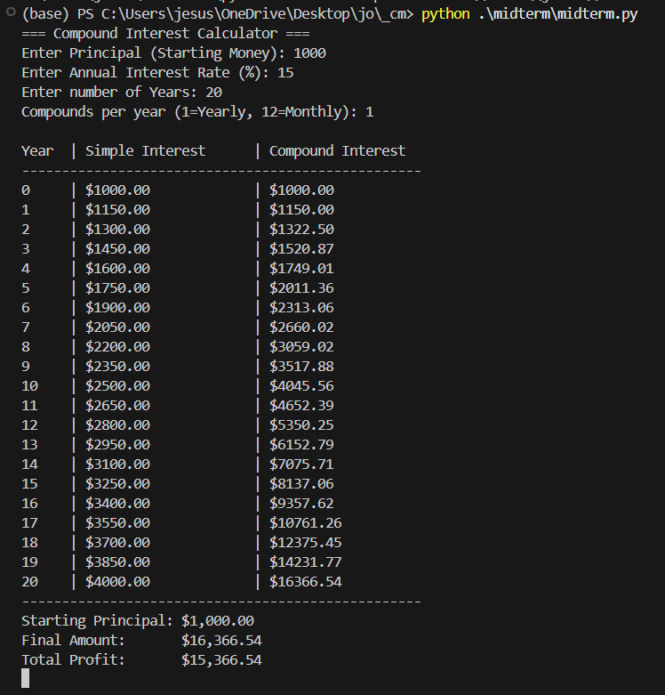
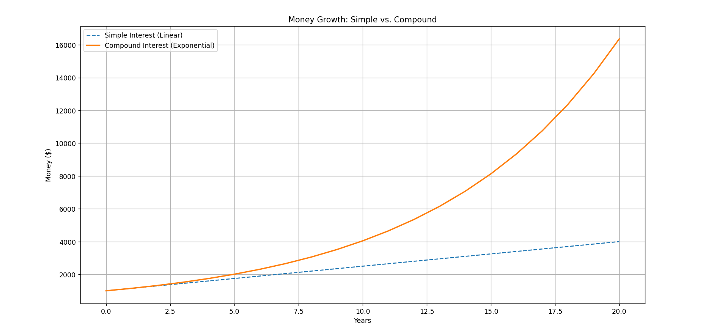

# Compound Interest Calculator

111210554 陳家盛

## 1. Project Overview
This is a Python program that compares two different ways money grows over time: **Simple Interest** vs. **Compound Interest**. It helps visualize why investing early is powerful.

The program calculates the final amount based on user inputs and generates a graph to show the difference.

## 2. Mathematical Formulas Used

### Variables
* **P (Principal):** The starting money.
* **r (Rate):** The annual interest rate (in decimal, e.g., 0.15 for 15%).
* **t (Time):** Number of years.
* **n:** Number of times interest is calculated per year (e.g., 1 for Yearly).

### Simple Interest (Linear Growth)
The interest is calculated **only** on the Principal amount.
$$A = P(1 + rt)$$

### Compound Interest (Exponential Growth)
The interest is calculated on the Principal **PLUS** any interest already earned (Interest on Interest).
$$A = P(1 + \frac{r}{n})^{nt}$$

---

## 3. Demonstration Case
Here is a demonstration of how the math works using specific numbers.

**Scenario:**
* **Starting Capital (Principal):** $1,000
* **Interest Rate:** 15% per year
* **Duration:** 20 Years
* **Compounding:** Once per year (Yearly)

### The Results

| Type | Calculation | Final Amount | Total Profit |
| :--- | :--- | :--- | :--- |
| **Simple Interest** | $1000 \times (1 + 0.15 \times 20)$ | **$4,000.00** | $3,000 |
| **Compound Interest** | $1000 \times (1.15)^{20}$ | **$16,366.54** | $15,366 |

### Analysis
As you can see, with **Simple Interest**, you end up with **$4,000**.
But with **Compound Interest**, you end up with **$16,366**.

This difference happens because in Compound Interest, the profit you made in Year 1 starts earning its own profit in Year 2. Over 20 years, this "Snowball Effect" makes the final amount **4 times larger** than Simple Interest.

---

## 4. How to Run the Code

1. Install the required library for graphing:
   ```bash
   pip install matplotlib

2. Run the Python file
    ```bash
    python midterm.py

---

## 5. Result





## 6. References

### Mathematical Concept
* **Source:** Investopedia
* **Article:** "Compound Interest: Meaning, Calculation, and Examples"
* **URL:** https://www.investopedia.com/terms/c/compound.asp
* **Usage:** Used to verify the compound interest formula $A = P(1 + \frac{r}{n})^{nt}$ and understand the difference between linear (simple) and exponential (compound) growth.

### Programming & Graphing
* **Source:** Matplotlib 3.10.8 Documentation
* **Article:** "Pyplot tutorial"
* **URL:** https://matplotlib.org/stable/tutorials/pyplot.html
* **Usage:** Referenced for using the `matplotlib.pyplot` library to generate the comparison line graph (plotting `simple_values` and `compound_values` lists).

